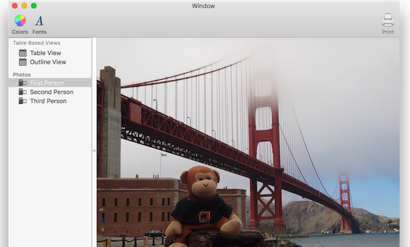

# MacImages

Source code for the [Working with Images](https://docs.microsoft.com/xamarin/mac/app-fundamentals/image) documentation on [Xamarin Documentation](http://docs.microsoft.com/xamarin)

When working with C# and .NET in a Xamarin.Mac application, you have access to the same Image and Icon tools that a developer working in in *Objective-C* and *Xcode* does.

There are several ways that image assets are used inside a macOS application. From simply displaying an image as part of your application's UI to, assigning it to a UI control such as a Tool Bar or Source List Item, to providing Icons, Xamarin.Mac makes it easy to add great artwork to your macOS applications in the following ways:

- **UI Elements** - Images can be displayed as backgrounds or as part of your application in a Image View (`NSImageView`).
- **Button** - Images can be displayed in buttons (`NSButton`).
- **Image Cell** - As part of a table based control (`NSTableView` or `NSOutlineView`), images can be used in a Image Cell (`NSImageCell`).
- **Toolbar Item** - Images can be added to a Toolbar (`NSToolbar`) as a Image Toolbar Item (`NSToolbarItem`).
- **Source List Icon** - As part of a Source List (a specially formatted `NSOutlineView`).
- **App Icon** - A series of images can be grouped together into a **.icns** set and used as your application's icon. See our [Application Icon](https://docs.microsoft.com/xamarin/mac/deploy-test/app-icon) documentation for more information.

Additionally, macOS provides a set of predefined images that can be used throughout your application. This example covers using an Image in Xamarin.Mac in all of the above listed situations.

## Prerequisites

- Mac computer with the latest version of macOS.
- [Visual Studio for Mac](https://visualstudio.microsoft.com/vs/mac/).
- Latest version of [Xcode](https://developer.apple.com/xcode/) from Apple.

## Running the sample

1. Open the solution file (**.sln**) in Visual Studio for Mac.
1. Use the **Run** button or menu to start the app.
