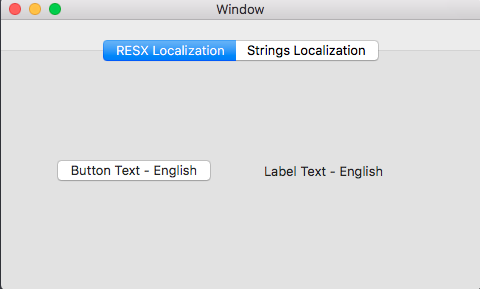

# XMLocalizationSample

This sample shows two methods for localization your Xamarin.Mac application:
- .resx files
- Storyboard string files.

Due to bug https://bugzilla.xamarin.com/show_bug.cgi?id=45696, where resx file localization is not being handled 
correctly during builds, custom MSBuild has been added to make things work. See CustomBuildActions.targets for details.
 
To add storyboard localization in Xcode:
  - Open Main.storyboard in Xcode, select it in the Xcode project tree, then click "Localize" in the first tab of the right inspector.

  

  - Then select the root project in the project tree, change the upper dropdown to point to the project.
 

  

  - Then enable Base localization.
 

  

  - Then add the specific languages in question.
 

  

  - Close Xcode and delete Main.storyboard from your project, as it now is copied into specific Resources/ folder.

## Build Requirements

OS X 10.11, Xcode 8.0 or later

## Runtime
OS X 10.11

## Copyright

Released under the MIT license

## Author

Chris Hamons
