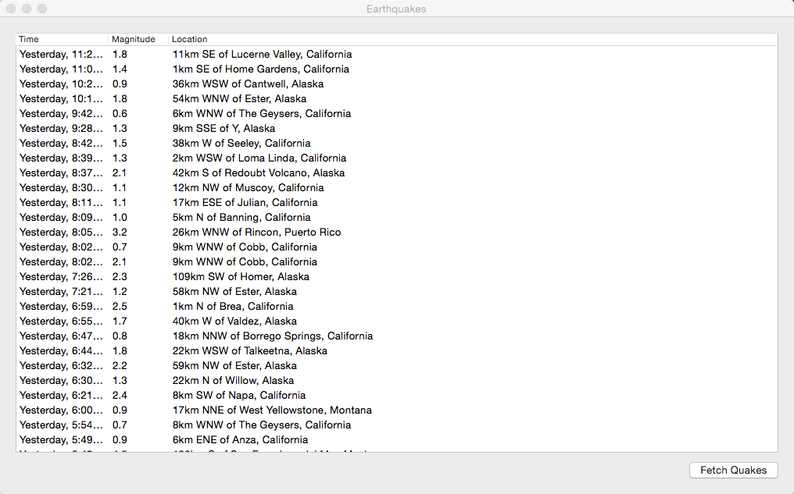

# Earthquakes

Most applications that use Core Data employ a single persistent store coordinator to mediate access to a given persistent store. Earthquakes shows how to use an additional "private" persistent store coordinator when creating managed objects using data retrieved from a remote server.

The main persistent store coordinator is vended by a singleton "stack controller" object (an instance of CoreDataStackManager). It is the responsibility of its clients to create a managed object context to work with the coordinator. The stack controller also vends properties for the managed object model used by the application, and the location of the persistent store. Clients can use these latter properties to set up additional persistent store coordinators to work in parallel with the main coordinator.

Current version of Xamarin Studio have no support for xcdatamodeld. If you want to use them in your applications
use Xcode to create data model files and momc utility to compile xcdatamodeld to mom. Read Apple's doc for more info: https://developer.apple.com/library/mac/documentation/Cocoa/Conceptual/CoreData/Articles/cdUsingMOM.html

## Build Requirements

OS X 10.10, Xcode 6.0 or later

## Runtime

OS X 10.10

## License

Xamarin port changes are released under the MIT license
